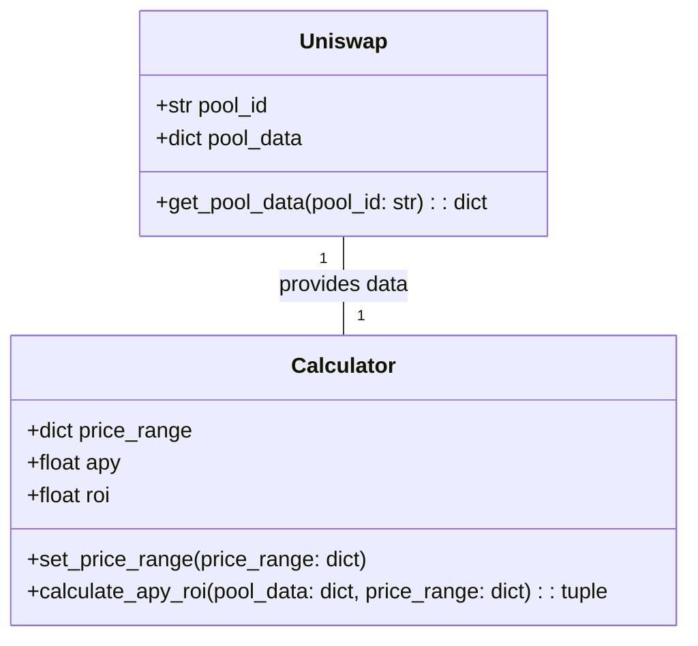
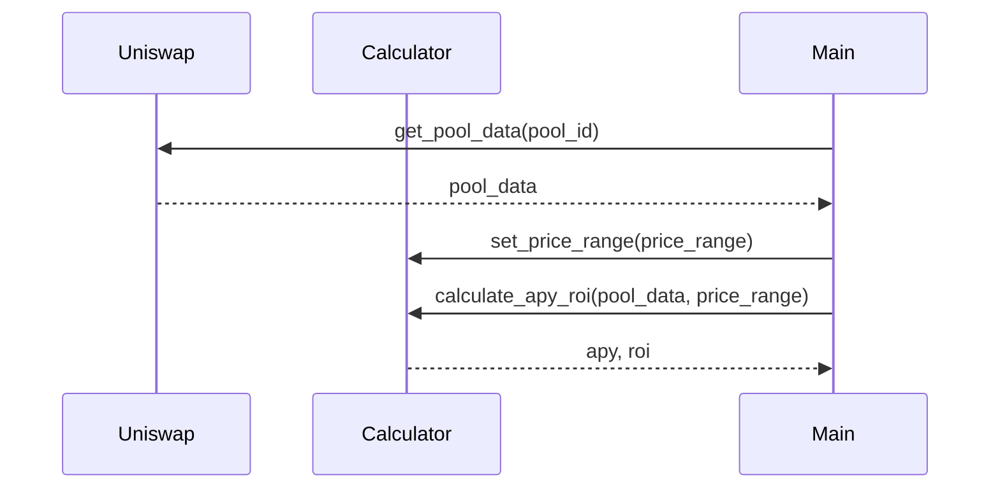

## Implementation approach
The python system will be built using Flask, a lightweight and flexible web framework. We will use the Uniswap Python SDK to interact with the Uniswap API. For the frontend, we will use Bootstrap to create a user-friendly interface. The application will be containerized using Docker for easy deployment and scalability. The difficult point of the requirements is to calculate APY / ROI based on user settings and Uniswap V3 data. We will need to understand and implement the Uniswap V3 formula in our system.

## Python package name
```python
"uniswap_simulator"
```

## File list
```python
[
    "main.py",
    "uniswap.py",
    "calculator.py",
    "templates/index.html",
    "static/css/main.css",
    "Dockerfile",
    "requirements.txt"
]
```

## Data structures and interface definitions


## Program call flow


## Anything UNCLEAR
The requirement is clear to me.